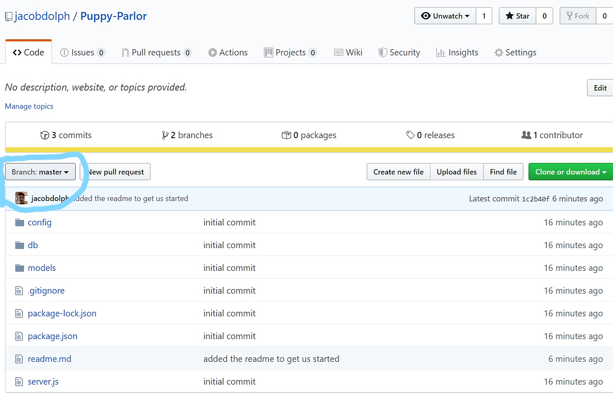
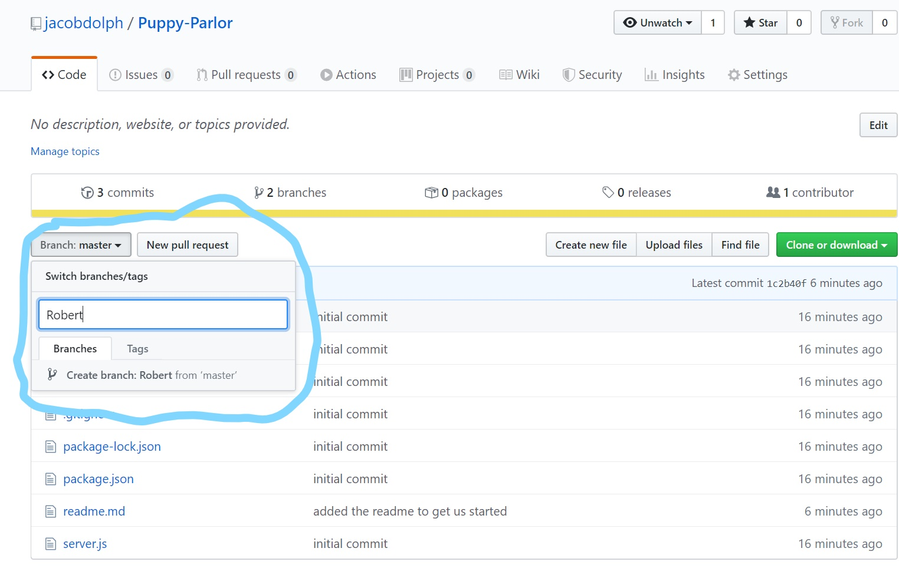

### Hey team hows it going!
Lets git this started!, so just to make it easier just in case anyone has set up their database a little different,
Lets just remember a couple of things. if you havent already set it up, lets get our env variables set because thats how I have the config files started

```
code ~/.bash_profile

then

just like our passwords

export MYSQL_PASSWORD='whatever your password is'
export MYSQL_USERNAME='whatever your root username is... for some people its root!'
```

Once you get that set up just run 

source ~/.bash_profile

that will refresh your environment variables

then in the command line just run 
```
 npm i express mysql2 sequelize sequelize-cli
 ```

* Click
,

* Add branch
,


​Type in your name and create a new branch.
when you push your code to git hub you will 
push to origin (your name)
```
push origin Jacob
```

create a pull request

and then we will review it and merge it to master!

but in order for branching to work we need to communicate what we are working on and when we are ready to push something to master.

lets give this a go because branching is important to know to work in the tech.